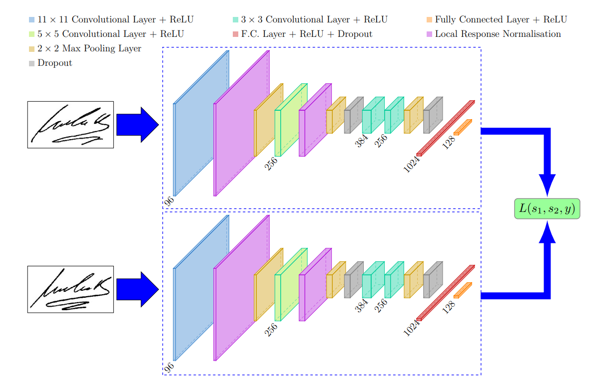
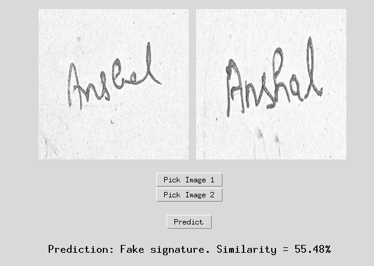
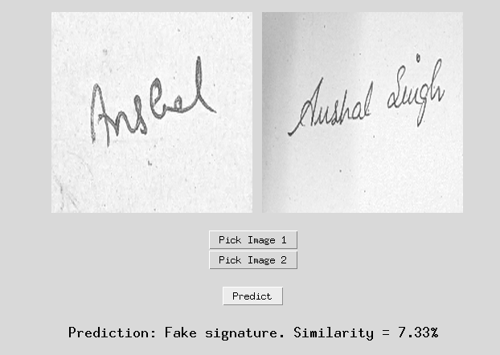
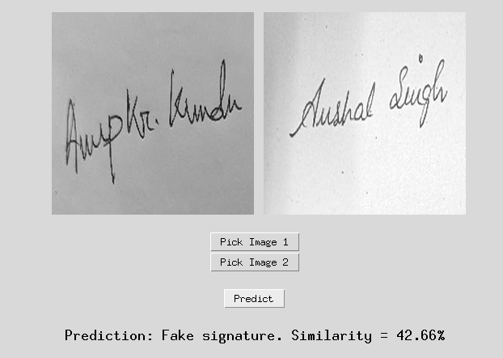
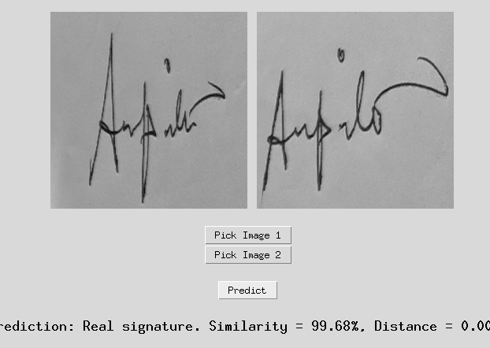

# Signature-Forgery-Detection
The objective is to
develop a machine learning model that can automatically verify the authenticity of
handwritten signatures, enabling faster and more accurate signature validation
processes.

<br></br>

# 1. Model
- The model used for the implementation of this feature is `SigNet: Convolutional Siamese Network for Writer Independent Offline Signature
Verification`.

I have tried to use the architechture as defined in the paper with very slight modifications.
The architechture of the base model is as follows:<br></br>


<br></br>

# 2. Dataset
The dataset used for the training is as follows:
* CEDAR: 
This dataset contains signatures by 55 people written in Latin script. Each person has 24 genuine and 24 forged signatures.

* BHSig260 Bengali: 
This dataset contains signatures by 100 people written in Bengali script. Each person has 24 genuine and 30 forged signatures.

* BHSig260 Hindi: 
This dataset contains signatures by 160 people written in Hindi script. Each person has 24 genuine and 30 forged signatures.

```
├── BHSig260-Bengali
│   └── BHSig260-Bengali
├── BHSig260-Hindi
│   └── BHSig260-Hindi
├── CEDAR
│   └── CEDAR
└── README.md
```
<br></br>


# 3. Approach
<b>The aprroach taken for the separation of real signatures v/s forged ones:</b>

There are two models working in tandom to recognise fake signatures.

### 1. Cross paired model<br>
This model is trained on cross paired images, meaning this dataset included for one person:<br>
Real images, forged images, and (real or forged images for a different person).
This model aims to eliminate different looking signatures without having a big focus on similar looking images and hence simplifying the second model's work.

The training script for this model is : [here](notebooks/all_cross_pair_train.ipynb)

Classification Report :
```py
              precision    recall  f1-score   support

         0.0       0.92      0.93      0.93       841
         1.0       0.67      0.64      0.66       183

    accuracy                           0.88      1024
   macro avg       0.80      0.79      0.79      1024
weighted avg       0.88      0.88      0.88      1024
```

### 2. Similar pair model<br>
This model's dataset is such that it includes real-real, real-fake pairs but for only one individual in a sample.
This model focuses on accurately identifying forgeries after the previous model has already eliminated diffrent looking signatrues.

The training script for this model is : [here](notebooks/cedar_non_cross.ipynb)

Classification Report :
```py
              precision    recall  f1-score   support

         0.0       0.85      1.00      0.92       497
         1.0       1.00      0.83      0.91       527

    accuracy                           0.91      1024
   macro avg       0.92      0.91      0.91      1024
weighted avg       0.92      0.91      0.91      1024
```
<br></br>

# 4. Results

The results and a demo video is attached below:<br>
* Sample 1<br>

<br>

* Sample 2<br>

<br>

* Sample 3<br>

<br>

* Sample 4<br>

<br>

* Sample Video
[Here](https://youtu.be/R9z_dTel6Ug)<br>

# 5. Scope for improvement
- The `Similar pair model` is currently only trained on CEDAR dataset and not the combined one. This can be improved further.
- More sophisticated model architechture could be tried with.
- Please let me know if you have any more suggestions / remarks.


# 6. References
- Paper <br>
[SigNet: Convolutional Siamese Network](https://arxiv.org/pdf/1707.02131v2.pdf)<br>

- Github Repos<br>
[Offline-Signature-Verification](https://github.com/hlamba28/Offline-Signature-Verification-using-Siamese-Network/tree/master)<br>
[SigNet](https://github.com/AtharvaKalsekar/SigNet/tree/master)<br>

- Articles<br>
[Medium article](https://medium.com/swlh/signet-detecting-signature-similarity-using-machine-learning-deep-learning-is-this-the-end-of-1a6bdc76b04b)<br>